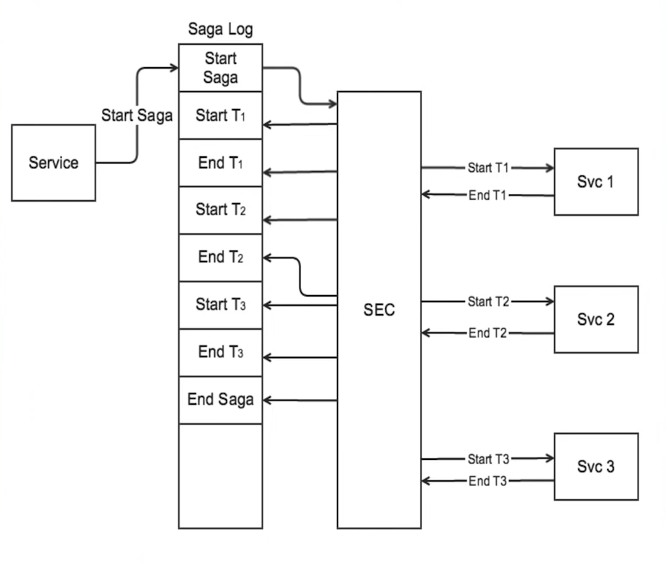
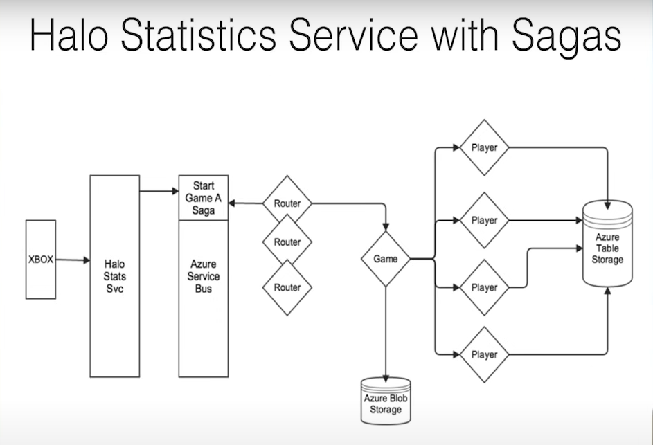

# SAGA

> Reference: <https://www.youtube.com/watch?v=xDuwrtwYHu8>

Saga is a collection of sub-transactions (requests) where each sub-transaction has a compensating transaction.

In sagas pattern, atomicity is traded-off for availability. Our system can be in an inconsistent state for a period of time. We have to minimize this window as short as possible.

> Hypothesis: If possible, we have to enforce isolation so that one saga is not affecting the others

Saga guarantee either:

-   T1, T2, ..., Tn
-   T1, T2, ..., Tj, Cj, ..., C2, C1

## Compensating request

Compensating request is a transaction (request) that will semantically return the system into a consistent state. There are two types of compensating requests:

-   Forward recovery
-   Backward recovery

A Cn MUST semantically undoes Tn.

A compensating request must be idempotent. We need to be able to retry it indefinitely until it succeed.

### Forward recovery

For forward recovery, sub-requests (Ti) MUST also be idempotent.

## Saga Log

Saga Log is important to ensure our saga is executed the way we expected it, either it succeed or aborted (and successfully recovered).

Saga Log must be durable and distributed, for example we can use Kafka for our service bus.

### Saga Log Use Case Example - Car Rental System

#### Successful saga

-   Begin Saga
-   Start Book Hotel (T1)
-   End Book Hotel (T1)
-   Start Book Car Rental (T2)
-   End Book Car Rental (T2)
-   Start Book Flight (T3)
-   End Book Flight (T3)
-   End Saga

Notice that the order here is important. We want to ensure that the most critical step (that has the most risk to be compensated or recovered) is executed on the last, in this case the flight booking.

#### Unsuccessful Saga (Backwards Recovery)

-   Begin Saga
-   Start Book Hotel (T1)
-   End Book Hotel (T1)
-   Start Book Car Rental (T2)
-   Abort Saga
-   Start Compensate Book Car Rental (C2)
-   End Compensate Book Car Rental (C2)
-   Start Compensate Book Hotel (C1)
-   End Compensate Book Hotel (C1)
-   End Saga

If for any reason the book car rental (T2) is failed, we must abort the saga and start compensating requests.

## Saga Execution Coordinator (SEC)

A SEC responsibility are:

-   interprets & writes to saga log
-   applies saga sub requests
-   applies saga compensating requests when necessary

### When to apply compensating requests

-   aborted saga response
-   start requests fails
-   SEC crashses (non-safe state)

### What happens when SEC fails?

> You can skip this section if all your normal requests (Ti) are idempotent. Just spin up another SEC and reprocess the request.

We need to determine if the saga is in a safe state or not.

Safe state:

-   All executed sub-requests are complete (start Ti & end Ti both logged)
-   Saga has been aborted, proceed with compensating requests

Un-safe state:

-   Start Ti logged, no end Ti logged:
    -   Abort saga
    -   Start compensating requests

## Request Messaging Semantics

-   Sub-requests (Ti): at most once
-   Compensating requests (Ci): at least once

## Distributed Sagas

We can define distributed sagas in 3 characteristics:

-   Distributed/Durable saga log
-   SEC process
-   Compensating requests: idempotent

## Halo 4

The speaker mentioned about the Halo 4's statistic service.

She mentioned there is one little shortcut that the team took on when building statistic processing saga after a game ends (32 players max).

When the game ends, XBOX sends the stats to the Halo Stats Svc which sends a message to the Azure service bus to start the Game A Saga. The router notice this and will pass this message to virtual actor Game (diamond grain) to process the statistic. The Game will act as the SEC and command a max of 32 Player actors to process the statistic and write the result to their own partiion on Azure key-value storage.

If one of the players failed to write the statistic to their partition, the saga will back off and retry later to not hammer down the system. When the saga retry, instead of rolling back the requests, they replay the requests. The sub-requests are idempotent which is a must for forward recovery technique on saga pattern.

Now the shortcut she mentioned, when the saga retried instead of writing to the Azure message bus 32 times per game, they just retry everything if one of the request failed until all of them succeed.
