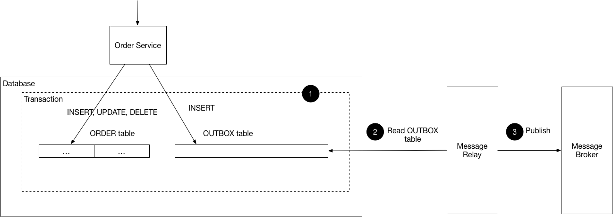

# Change Data Capture (CDC) & transactional outbox pattern



Change Data Capture (CDC) is a set of software design patterns used to determine and track the data that has changed so that action can be taken using the changed data. CDC is an essential part of a data integration pipeline, as it allows data to be shared between different systems in real-time.

Transactional outbox pattern is a pattern that is used to ensures atomicity between transactional database operation and message publishing. A message is sent to the message broker only if the transaction that updates the database is successful. If the transaction that updates the database fails, the message is not sent to the message broker.

CDC acts as a message relay component which enables the transactional outbox pattern. For example, consider the user registration process. The user registration process involves updating the user entity in the database and sending a message to the message broker. The message sent to the message broker is used to notify other services that a new user has been registered.

## Debezium

Debezium is an open-source software platform that captures row-level changes in databases and streams them to Apache Kafka. Debezium is built on top of Apache Kafka and provides a Kafka Connect source connector that monitors the database for row-level changes. Debezium consist of 2 main components:

- Source connectors: monitor specific database management systems (DBMS) for row-level changes.
- Sink connectors: write data from Kafka topics to other DBMS.

We only use the source connector to enables the transactional outbox pattern.

## Steps to set up user service's PostgreSQL `user_outbox` table

We are using Debezium PostgreSQL source connector to monitor the `user_outbox` table in the PostgreSQL database of the user service. The `user_outbox` table is used to store messages that need to be sent to the message broker. The Debezium PostgreSQL source connector monitors the `user_outbox` table for row-level changes and sends the messages to the message broker.

### Set up containers

```sh
docker compose up -d
```

### Confirm PostgreSQL database configuration

In the PostgreSQL client, execute following queries:

```sql
show wal_level; -- Ensure it is `logical`
show max_replication_slots; -- 10
show max_wal_senders; -- 10
show shared_preload_libraries; -- decoderbufs
```

### Perform database migrations

```sh
cd user-service
make migration:postgresql:up
```

### Register PostgreSQL source connector

```sh
cd user-service
make debezium:register-postgresql-source-connector
```

### Start the user service

```sh
cd user-service
make start-dev
```

### Hit the registration endpoint

```sh
curl -X 'POST' 'http://localhost:8100/v1/register' -H 'accept: application/json' -H 'Content-Type: application/json' -d '{
  "username": "wendy",
  "password": "password",
  "email": "wendy@example.com",
  "phone_number": "+62891234567890",
  "first_name": "Wendy",
  "last_name": "Surya Wijaya"
}'
```

### Visit Kafdrop UI

Visit <http://localhost:9001/topic/user.registered.v1/allmessages> to view all topic messages produced by the Debezium PostgreSQL source connector.

Here is [an example](../assets/data/cdc-debezium-message-example.json) of the produced message.

## Why not Event sourcing?

[Event sourcing](https://microservices.io/patterns/data/event-sourcing.html) is a pattern that stores the state of a business entity as a sequence of events. Events act as the source of truth in the system. Event sourcing provides a 100% reliable [audit log](https://microservices.io/patterns/observability/audit-logging) which make it a good pattern for use cases that need to keep history of the changes made to a business entity, for example a reservation or order placement.

However, event sourcing is not a good pattern for use cases, like user registration, that need real-time constraint and [linearizability](https://jepsen.io/consistency/models/linearizable). Event sourcing only provides eventual consistency.

## Resources

-   [Official Debezium PostgreSQL source connector documentation](https://debezium.io/documentation/reference/stable/connectors/postgresql.html)
-   [Tutorial Debezium PostgreSQL with decoderbufs (default plugin)](https://dev.to/emtiajium/track-every-postgresql-data-change-using-debezium-5e19)
-   [Tutorial Debezium PostgreSQL with pgoutput](https://medium.com/@arijit.mazumdar/beyond-the-basics-of-debezium-for-postgresql-part-1-d1c6952ae110)
-   [Alternative (Confluent Platform AIO)](https://github.com/confluentinc/cp-all-in-one/blob/latest/cp-all-in-one/docker-compose.yml)
-   [Tutorial Confluent Elasticsearch sink connector](https://www.confluent.io/blog/kafka-elasticsearch-connector-tutorial/)
-   [Tutorial Debezium PostgreSQL source connector + Confluent Elasticsearch sink connector](https://medium.com/@cagataygokcel/real-time-data-streaming-from-postgresql-to-elasticsearch-via-kafka-and-debezium-b624b43cadb)
