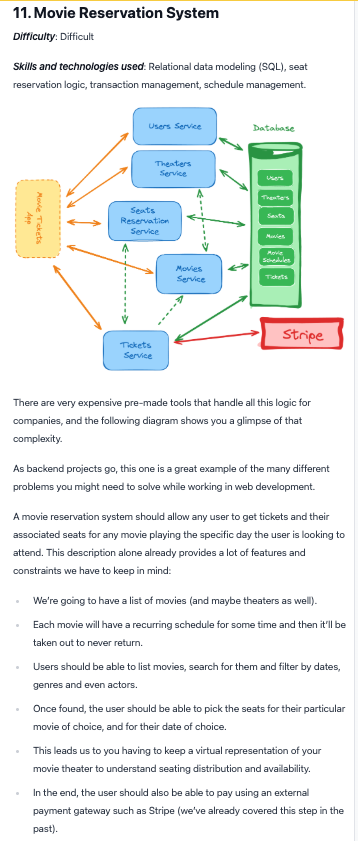

# Architecture Design

Evolving design of the movie reservation system.

## Requirements

### User Authentication and Authorization

- Users should be able to sign up and log in.
- You also need roles for users, such as admin and regular user.
- Admins should be able to manage movies and showtimes.
- Regular users should be able to reserve seats for a showtime.

> You can create the initial admin using seed data. Only admins should be able to promote other users to admin and be able to do things related to movie management, reporting, etc.

### Movie Management

- Admins should be able to add, update, and delete movies.
- Each movie should have a title, description, and poster image.
- Movies should be categorized by genre.
- Movies should have showtimes.

### Reservation Management

- Users should be able to get the movies and their show times for a specific date.
- Users should be able to reserve seats for a showtime, see the available seats, and select the seats they want.
- Users should be able to see their reservations and cancel them (only upcoming ones).
- Admins should be able to see all reservations, capacity, and revenue.

## Optional features

- payment processing
- email notifications

## Implementation Considerations

- Think about the data model and relationships between entities.
- Think about how you will avoid overbooking, and how you will handle seat reservations.
- Think about how you will handle the scheduling of showtimes.
- Think about how you will handle the reporting of reservations.
- Think about how you will handle the authentication and authorization of users.
